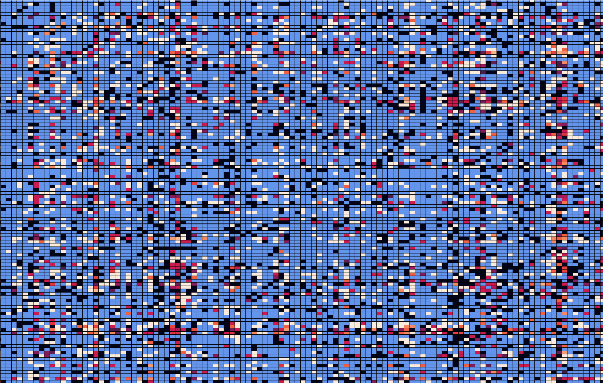

<h2> Data Mining Project on Esport Team Compatability (League of Legends) </h2>

    <section name="summary">
      

        Program designed to statistically model winrates--in League of Legends--corresponding between characters 
        if given player name(s). This would help to determine whether meta-analysis assumptions would fit your 
        team or you as a player and how one (team or player) could adapt for the future given current performance 
        with certain champions (characters) they want to focus on. 
      

      <h4> Technology Stack: </h4>
        <ul> 
          <li> Python </li>
          <li> Pandas </li>
          <li> Matlab plot </li>
          <li> Seaborn </li> 
        <ul> 
    </section>
    

    
    
  Image sourced 475 games coming from top 25 players on 11/17/2022. 
      Note the blue is null/no games found with that champion combination. 
     
 
    

    <section name="how-to-use">
      <h4> How To Use And Set Up </h4> 
      

        This runs on an IDE and does not have a UI set up. To use, you have to have the technology stack
       (programming IDE that can run Python with the listed packages installed) to be able to run this. 
         
      <h4> Once you have that: </h4>
      
 
      <ol> 
        <li> Make sure to input Riot's Developer API Key (Get that from here: https://developer.riotgames.com/ )
        <li> Input the summoner names you want data collected about in the "list_of_names_to_manipulate" array. 
        <li> If you're running this for the first time 
          <ul>
             <li> IT WILL TAKE TIME -- Riot API can only be accessed so much per minute or else it will give 429 (Rate Limit) error.
             <li> Make sure that all methods (at the bottom of the program in the try - catch) are not commented out, and they are set to run. 
          </ul>
         <li> If you're not running this for the first time and just want to display the heatmap, 
           <ul>
             <li> Comment out every method besides the last (that is present in the try-catch) 
          </ul>
      <ol>
    </section>
    

      <section name="short-comings">
        <h3> Short-comings Note: </h3>
        

          The short-comings of this software is that it does not give a direct solution, but helps to determine
          the problems within (team's or player's) gameplay. 
        

    </section>
    

      <section name="notes"> 
        <h3> Notes for future development: </h3>
         <ul>
           <li> Program needs a UI / UX to be more user-friendly. </li>
           <li> Program files can be better managed by concatenating the file names with the list of names taken and checking to see if they exist. </li>
           <li> Program files can be further improved by not being only specific to the local path </li> 
           <li> Program needs better way of managing if you're running it for the first time, want to source files again, or just looking at heatmap.
         </ul>
      </section>
    

 
